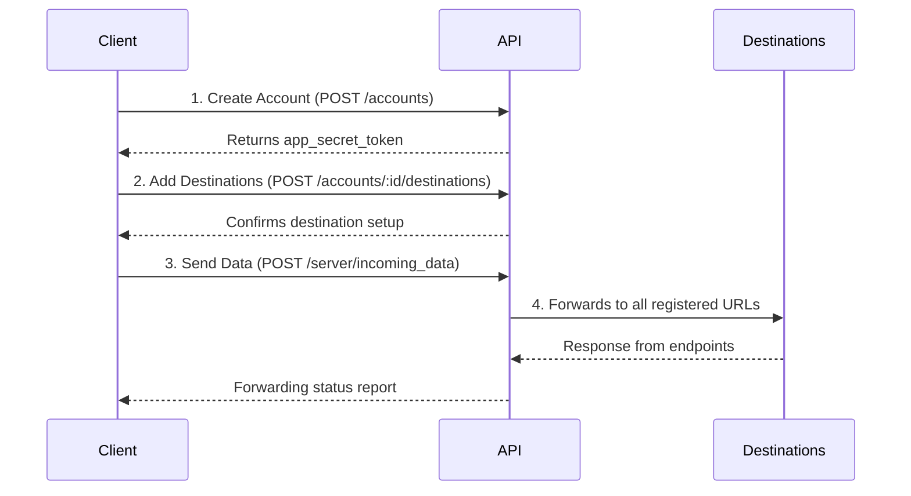

# Data Pusher - Node.js Webhook Forwarder


A robust Express.js application that receives JSON data and forwards it to configurable webhook destinations with authentication support.

## 📌 Key Features

- **Account Management** (CRUD operations)
- **Destination Configuration** (Multiple endpoints per account)
- **Secure Data Forwarding** (Token-based authentication)

## 🚀 Workflow Overview



## 🔧 API Endpoints

### Account Management
| Method | Endpoint               | Description                              |
|--------|------------------------|------------------------------------------|
| POST   | `/accounts`            | Create new account                       |
| GET    | `/accounts/:id`        | Get account details                      |
| PUT    | `/accounts/:id`        | Update account                           |
| DELETE | `/accounts/:id`        | Delete account (and all its destinations) |

### Destination Management
| Method | Endpoint                               | Description                |
|--------|----------------------------------------|----------------------------|
| POST   | `/accounts/:id/destinations`           | Add new destination        |
| GET    | `/accounts/:id/destinations`           | List all destinations      |
| PUT    | `/accounts/:id/destinations/:destId`   | Update destination         |
| DELETE | `/accounts/:id/destinations/:destId`   | Remove destination         |

### Data Handling
| Method | Endpoint               | Description                              |
|--------|------------------------|------------------------------------------|
| POST   | `/server/incoming_data`| Forward JSON data to all destinations    |


## 🛠 Setup & Installation

### Prerequisites
- Node.js v18+
- npm v9+
- SQLite3 (comes bundled with Node.js)

### 1. Clone the Repository
```bash
git clone https://github.com/yourusername/data-pusher.git
cd data-pusher
```
### 2. Run the Project
```bash
npm install
npm start
```
## 📚 Postman Collection
[](https://www.postman.com/planetary-station-565633/customer-labs-task1/collection/tu9jb0l/data-pusher?action=share&creator=32014221)
